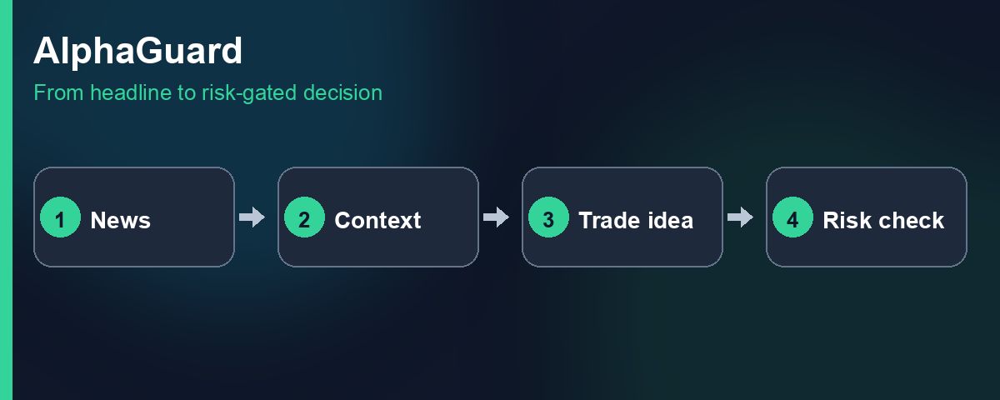
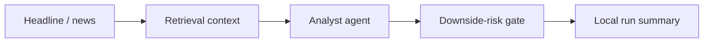

# AlphaGuard

Multi-agent **financial research** — news → context → BUY / HOLD / PASS → downside-risk veto.

Local research lab for how AI trade ideas and risk controls should work together — not a brokerage or PnL product.



### The problem

Markets move on information faster than teams can manually process it. Language models can propose trade ideas quickly — but an unchecked proposal is not a risk decision. AlphaGuard separates **what the AI thinks** from **whether downside risk allows it to proceed**.

### How it works



1. Ingest a financial headline (replay fixtures by default; live paths optional).
2. Retrieve supporting context (fixture RAG for smoke; Qdrant when configured).
3. An LLM analyst proposes **BUY**, **HOLD**, or **PASS** with rationale.
4. An XGBoost downside-risk gate can **veto** before a proposal is allowed to proceed.
5. Every run writes a **local run summary** (mandatory LLMOps baseline).

### Key engineering decisions

1. **Analyst LLM ≠ risk model** — proposal and downside veto are separate systems so risk policy stays deterministic and auditable.
2. **Replay-first smoke** — `make smoke` proves the full chain with fixtures; Kafka/Qdrant are optional for integration, not required to demo.
3. **Local run summary mandatory** — LangSmith / Phoenix are optional fail-open when configured; the local envelope always exists.

### Try it

```bash
uv sync --all-extras
cp -n .env.example .env
ollama pull gemma4:e2b   # or set OLLAMA_MODEL=qwen3.5:4b
make bundle
make smoke               # Kafka down; fixture RAG
```

Full clean-clone path, Ollama footguns, and optional Kafka/RSS: [`GETTING_STARTED.md`](GETTING_STARTED.md).

[](https://github.com/Alpha-W0lf/alphaguard/actions/workflows/ci.yml)

### Stack

| Concern | Choice |
|---------|--------|
| Language | Python 3.11+ via `uv` (repo pin 3.12) |
| Orchestration | LangGraph + host Ollama |
| Risk gate | XGBoost downside-risk scorer + deterministic policy |
| RAG (smoke) | Fixture retrieval hits |
| Infra (optional) | Compose Kafka + Qdrant |
| LLMOps | Local run envelope mandatory; LangSmith / Phoenix fail-open when enabled |

### Deeper docs

- [`docs/VISION.md`](docs/VISION.md) — product / why  
- [`docs/ARCHITECTURE.md`](docs/ARCHITECTURE.md) — contracts / how  
- [`docs/FINANCE_HONESTY.md`](docs/FINANCE_HONESTY.md) — gate ≠ alpha; lab metrics; no PnL claims  
- [`GETTING_STARTED.md`](GETTING_STARTED.md) — operator path  
- [`INTERVIEW.md`](INTERVIEW.md) — staff FAQ  
- [`docs/assets/`](docs/assets/) — packaging visuals  
- [`LICENSE`](LICENSE) — PolyForm Noncommercial 1.0.0 (source-available / non-commercial)

Building similar systems? Reach me on [LinkedIn](https://www.linkedin.com/in/tchacko1/).
