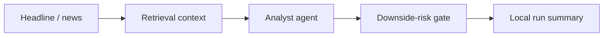
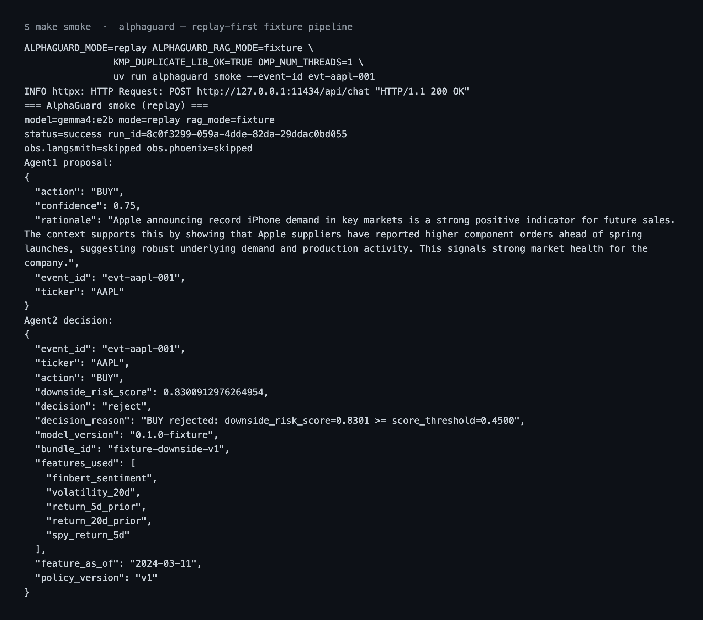

# AlphaGuard

Multi-agent **financial research** — news → context → BUY / HOLD / PASS → downside-risk veto.

Local research lab for how AI trade ideas and risk controls should work together — not a brokerage or PnL product.


### The problem

Markets move on information faster than teams can manually process it. Language models can propose trade ideas quickly — but raw proposals cannot serve as risk decisions without verification. AlphaGuard separates **unconstrained idea generation** from a **strict, code-owned downside-risk veto**.

### How it works



1. Ingest a financial headline (replay fixtures by default; Kafka streaming path optional).
2. Retrieve supporting context with strict point-in-time filtering (fixture RAG for smoke; Qdrant vector retrieval when configured).
3. An LLM analyst proposes **BUY**, **HOLD**, or **PASS** with structured rationale.
4. A calibrated XGBoost downside-risk gate applies an auditable **risk veto** before capital or execution can ever proceed.
5. Every run writes an immutable **local run summary** envelope (mandatory LLMOps baseline).

### Key engineering decisions

1. **Analyst LLM ≠ risk model** — idea generation and downside risk evaluation are decoupled by design. Risk policy remains deterministic, calibrated, and auditable rather than hidden in LLM token sampling.
2. **Strict as-of temporal isolation** — features and retrieval contexts strictly enforce point-in-time constraints (`available_at <= published_at`), eliminating look-ahead bias across both inference and training.
3. **Replay-first architecture** — `make smoke` proves the full vertical slice on fixtures; Kafka and Qdrant scale the same contracts when configured.
4. **Local-first LLMOps telemetry** — comprehensive execution metadata is always written locally to `artifacts/runs/`; LangSmith and Phoenix spans fail-open when configured.
5. **Empirical ML rigor** — parallel study matrices, leakage-free nested splits, and immutable run registries evaluate candidates on locked held-out test sets. We publish honest holdout metrics and never soften failed experiments or claim unverified alpha.

### Try it

**1. Stranger verification & tests (no host Ollama required — 0 MB model download):**

Default install is slim (no Torch). Install `[embed]` for Qdrant embeddings and `[train]` for offline FinBERT (`uv sync --extra embed` / `uv sync --extra train`).

```bash
uv sync                          # or: make sync
[ -f .env ] || cp .env.example .env
make bundle                      # builds local fixture risk bundle
make test                        # unit, golden, import boundary, and API tests
make smoke-fixture               # proves news -> context -> BUY -> risk veto -> envelope
```

**2. Live Ollama smoke (local LLM generator):**

```bash
ollama pull gemma4:e2b          # or set OLLAMA_MODEL=qwen3.5:4b
make smoke                      # Kafka down; fixture RAG
```

**3. Run FastAPI server:**

```bash
make serve                      # uvicorn alphaguard.api.app:app on http://127.0.0.1:8000
```

Full clean-clone path, Ollama footguns, and optional Kafka/RSS: [`GETTING_STARTED.md`](GETTING_STARTED.md).

Example `make smoke` run — the analyst proposes BUY on an Apple headline; the downside-risk gate **vetoes** it:



[](https://github.com/Alpha-W0lf/alphaguard/actions/workflows/ci.yml)

### Stack

| Concern | Choice |
|---------|--------|
| Language | Python 3.11+ via `uv` (repo pin 3.12) |
| Orchestration | LangGraph + host Ollama |
| Risk gate | XGBoost downside-risk scorer + deterministic policy |
| RAG (smoke) | Fixture retrieval hits |
| Infra (optional) | Compose Kafka + Qdrant |
| LLMOps | Local run envelope mandatory (always written); LangSmith / Phoenix fail-open when enabled (default skipped) |

### Deeper docs

- [`docs/VISION.md`](docs/VISION.md) — product / why  
- [`docs/ARCHITECTURE.md`](docs/ARCHITECTURE.md) — contracts / how  
- [`docs/FINANCE_HONESTY.md`](docs/FINANCE_HONESTY.md) — gate ≠ alpha; empirical lab metrics; zero fabricated alpha  
- [`docs/EXPERIMENTS.md`](docs/EXPERIMENTS.md) — experiment harness, run registry, and multi-seed search  
- [`docs/PROMOTION_POLICY.md`](docs/PROMOTION_POLICY.md) — multi-seed promotion gates and governance  
- [`GETTING_STARTED.md`](GETTING_STARTED.md) — operator path  
- [`FAQ.md`](FAQ.md) — Technical FAQ  
- [`docs/assets/`](docs/assets/) — packaging visuals  
- [`LICENSE`](LICENSE) — PolyForm Noncommercial 1.0.0 (source-available / non-commercial)

Building similar systems? Reach me on [LinkedIn](https://www.linkedin.com/in/tchacko1/).
