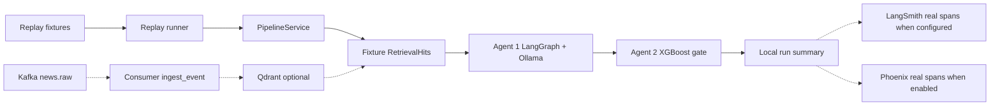
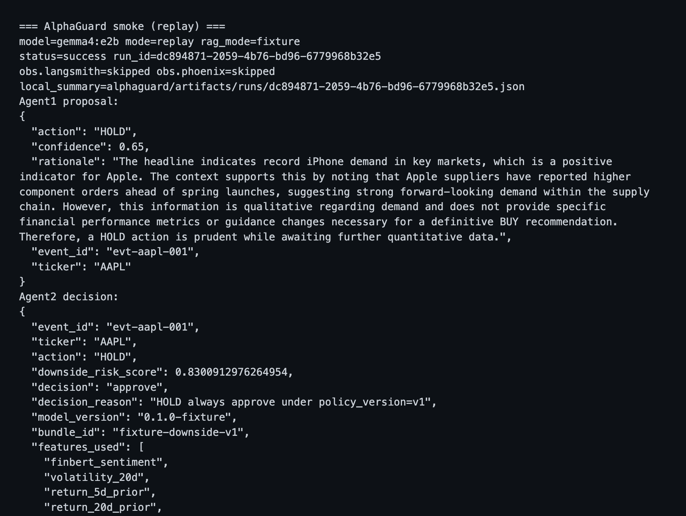
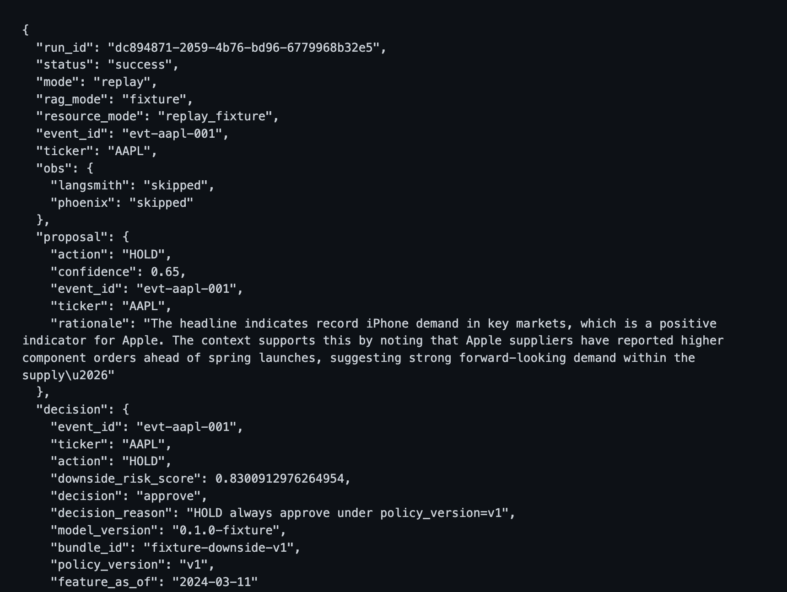

# AlphaGuard

Bounded public **interview lab**: one financial headline flows through replay ingest → RAG context → LangGraph Agent 1 (`BUY|HOLD|PASS`) → XGBoost downside-risk gate → local run summary.

This repo currently ships a **replay-first vertical slice**, not “v1 complete.” Default demo path is **fixture replay** — not live Kafka streaming. The fixture model bundle (`bundle_kind=fixture`) proves plumbing only. Guide **05a** builds `training_events.parquet`; Guide **05b** trains `bundle_kind=option_b` locally (see `docs/TRAINING_DATA.md`). **Default smoke still uses the fixture bundle.**

## Quick Start (replay smoke)

See **[`GETTING_STARTED.md`](GETTING_STARTED.md)** for the full clean-clone path. Short version:

```bash
uv sync --all-extras
cp -n .env.example .env
# Default generator (D1): gemma4:e2b — ensure Ollama ≥0.20+ and model pulled
ollama pull gemma4:e2b
# Fallback only if needed: export OLLAMA_MODEL=qwen3.5:4b && ollama pull qwen3.5:4b
make bundle              # writes data/fixtures/model_bundle_fixture/
make smoke               # Kafka must stay down; uses fixture RAG
```

Smoke prints Agent 1 JSON, Agent 2 decision (incl. `downside_risk_score`), and local envelope path under `artifacts/runs/`.

**Ollama / `gemma4:e2b`:** Default is `OLLAMA_MODEL=gemma4:e2b` (`.env.example` + config). Requires a current Ollama server (`GET http://127.0.0.1:11434/api/version` — Gemma 4 needs a post-0.18 build). If `pull` returns **412**, upgrade Ollama, then pull again. Documented D1 fallback remains `qwen3.5:4b` / `OLLAMA_FALLBACK_MODEL`. Preflight uses fallback when the primary tag is missing.

Optional **Kafka integration** (Guide 04): `docker compose up -d`, wait for healthchecks, then:

```bash
export ALPHAGUARD_MODE=live ALPHAGUARD_RAG_MODE=qdrant
uv run alphaguard kafka consume          # terminal 1
uv run alphaguard kafka produce --event-id evt-aapl-001   # or POST /trigger
# Optional Yahoo RSS → news.raw (Guide 06; Yahoo may flake — not required for smoke):
uv run alphaguard rss poll --ticker AAPL --max-items 10
# Live pytest (Compose must be up):
ALPHAGUARD_RUN_KAFKA_TESTS=1 uv run pytest -m kafka_integration -q
```

Compose image pin: Kafka is `bitnamilegacy/kafka:3.9.0` (free `bitnami/kafka:3.9.0` 404 on Docker Hub as of 2026-07-15). Smoke does **not** require Compose (fixture RAG is the default smoke path). Rebuild Qdrant collection if migrating from old hash-based point ids.

## Architecture (critical path)

Simplified from [`docs/ARCHITECTURE.md`](docs/ARCHITECTURE.md) §4. Kafka is mandatory in the architecture/Compose story; **optional for smoke**.



## Stack

| Concern | Choice |
|---------|--------|
| Language | Python 3.12 (`.python-version`) via `uv` |
| Orchestration | LangGraph |
| Local LLM | Host Ollama — default `gemma4:e2b`, fallback `qwen3.5:4b` |
| Agent 2 | XGBoost downside-risk scorer + deterministic approve/reject policy |
| RAG (smoke default) | Fixture `RetrievalHit`s (`ALPHAGUARD_RAG_MODE=fixture`) |
| Infra | Compose Kafka + Qdrant — **optional for smoke** |
| LLMOps | **Local run envelope mandatory**; LangSmith real fail-open spans when configured (Guide 07); Phoenix real fail-open spans when `PHOENIX_ENABLED` (Guide 08) |

Locked stack detail: [`docs/ARCHITECTURE.md`](docs/ARCHITECTURE.md) §2 · product framing: [`docs/VISION.md`](docs/VISION.md).

## Evidence screenshots

Local envelope fulfills packaging — **not** fabricated LangSmith/Phoenix UI. With default env, `obs.langsmith=skipped` and `obs.phoenix=skipped`.

GitHub Actions runs default `uv run pytest -q` on push to `main` and PRs (live markers excluded; no Ollama/smoke in CI).





Captions and redaction notes: [`docs/assets/README.md`](docs/assets/README.md).

## Docs

- [`GETTING_STARTED.md`](GETTING_STARTED.md) — clean-clone operator path
- [`INTERVIEW.md`](INTERVIEW.md) — staff FAQ / gotchas (≥15 themes)
- [`docs/WALKTHROUGH_10MIN.md`](docs/WALKTHROUGH_10MIN.md) — optional 10-min spoken outline (**interview prep**, not a build gate)
- [`docs/VISION.md`](docs/VISION.md) — product / why
- [`docs/ARCHITECTURE.md`](docs/ARCHITECTURE.md) — contracts / how (SSOT)
- [`AGENTS.md`](AGENTS.md) — agent rails
- [`docs/assets/`](docs/assets/) — packaging screenshots

## Limitations

- No brokerage APIs; no live trading
- FinBERT not loaded during smoke (precomputed fixture column)
- Eval harness: ≥21 **executed** goldens (schema/identity/as-of/gate/OOU + tmp-manifest vol-veto + fixture-path OOU); still **not** live-Ollama numeric schema-pass rates
- Option B dataset (05a): `uv run python scripts/build_training_events.py` — see `docs/TRAINING_DATA.md`
- Option B train (05b): `uv run python scripts/train_option_b_gate.py` → `data/derived/model_bundle_option_b/` (`bundle_kind=option_b`, nested time-HPO). Lab-scale metrics only; **default smoke stays fixture**. Optional demo:
  `MODEL_BUNDLE_DIR=data/derived/model_bundle_option_b ALPHAGUARD_REQUIRE_BUNDLE_KIND=option_b make smoke`
- Kafka+Qdrant thin integration (Guide 04): producer/consumer, `/trigger`, UUID5 upsert
- Live RSS (Guide 06): thin `alphaguard rss poll` operator path (Yahoo may flake; offline XML fixtures = CI truth) — **not** 24/7 reliability / **not** agent-on-consume
- LangSmith (Guide 07): real fail-open Client spans when `LANGSMITH_TRACING` + key; Phoenix (Guide 08): real fail-open OTEL chain spans when `PHOENIX_ENABLED`; default smoke never requires LangSmith key or Phoenix collector (`skipped`)
- Still a **vertical slice** / **not** a production risk model — build MV Met ≠ eval-complete or interview fluency proven
