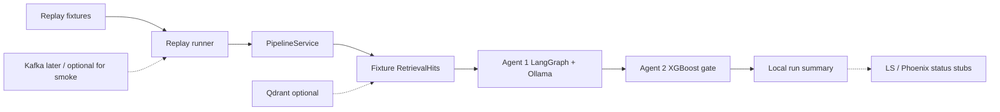

# AlphaGuard

Bounded public **interview lab**: one financial headline flows through replay ingest → RAG context → LangGraph Agent 1 (`BUY|HOLD|PASS`) → XGBoost downside-risk gate → local run summary.

This repo currently ships a **replay-first vertical slice**, not “v1 complete.” Default demo path is **fixture replay** — not live Kafka streaming. The fixture model bundle (`bundle_kind=fixture`) proves plumbing only; it is **not** Option B training proof.

## Quick Start (replay smoke)

See **[`GETTING_STARTED.md`](GETTING_STARTED.md)** for the full clean-clone path. Short version:

```bash
uv sync --all-extras
cp -n .env.example .env
# Default generator (D1): gemma4:e2b — ensure Ollama ≥0.20+ and model pulled
ollama pull gemma4:e2b
# Fallback only if needed: export OLLAMA_MODEL=qwen3.5:4b && ollama pull qwen3.5:4b
make bundle              # writes data/fixtures/model_bundle_fixture/
make smoke               # Kafka must stay down; uses fixture RAG
```

Smoke prints Agent 1 JSON, Agent 2 decision (incl. `downside_risk_score`), and local envelope path under `artifacts/runs/`.

**Ollama / `gemma4:e2b`:** Default is `OLLAMA_MODEL=gemma4:e2b` (`.env.example` + config). Requires a current Ollama server (`GET http://127.0.0.1:11434/api/version` — Gemma 4 needs a post-0.18 build). If `pull` returns **412**, upgrade Ollama, then pull again. Documented D1 fallback remains `qwen3.5:4b` / `OLLAMA_FALLBACK_MODEL`. Preflight uses fallback when the primary tag is missing.

Optional later: `docker compose up -d` for Kafka + Qdrant. Flip `ALPHAGUARD_RAG_MODE=qdrant` when Qdrant is up. Smoke does **not** require Compose (fixture RAG is the default smoke path).

## Architecture (critical path)

Simplified from [`docs/ARCHITECTURE.md`](docs/ARCHITECTURE.md) §4. Kafka is mandatory in the architecture/Compose story; **optional for smoke**.



## Stack

| Concern | Choice |
|---------|--------|
| Language | Python 3.12 (`.python-version`) via `uv` |
| Orchestration | LangGraph |
| Local LLM | Host Ollama — default `gemma4:e2b`, fallback `qwen3.5:4b` |
| Agent 2 | XGBoost downside-risk scorer + deterministic approve/reject policy |
| RAG (smoke default) | Fixture `RetrievalHit`s (`ALPHAGUARD_RAG_MODE=fixture`) |
| Infra | Compose Kafka + Qdrant — **optional for smoke** |
| LLMOps | **Local run envelope mandatory**; LangSmith / Phoenix best-effort **status stubs** today |

Locked stack detail: [`docs/ARCHITECTURE.md`](docs/ARCHITECTURE.md) §2 · product framing: [`docs/VISION.md`](docs/VISION.md).

## Evidence screenshots

Local envelope fulfills packaging until H2 is reversed — **not** fabricated LangSmith UI.


Captions and redaction notes: [`docs/assets/README.md`](docs/assets/README.md).

## Docs

- [`GETTING_STARTED.md`](GETTING_STARTED.md) — clean-clone operator path
- [`INTERVIEW.md`](INTERVIEW.md) — staff FAQ / gotchas (≥15 themes)
- [`docs/VISION.md`](docs/VISION.md) — product / why
- [`docs/ARCHITECTURE.md`](docs/ARCHITECTURE.md) — contracts / how (SSOT)
- [`AGENTS.md`](AGENTS.md) — agent rails
- [`docs/assets/`](docs/assets/) — packaging screenshots

## Limitations

- No brokerage APIs; no live trading
- FinBERT not loaded during smoke (precomputed fixture column)
- Eval golden set starts small (≥5 in-slice; grow to ≥20 before portfolio claim)
- Live RSS → Kafka E2E and full ~500-event Option B training are later guides
- LangSmith/Phoenix on the run envelope are **status stubs** today (no SDK spans yet); local `artifacts/runs/` envelope is the real LLMOps baseline
- Still a **vertical slice** — packaging docs/assets do **not** mean v1 complete
