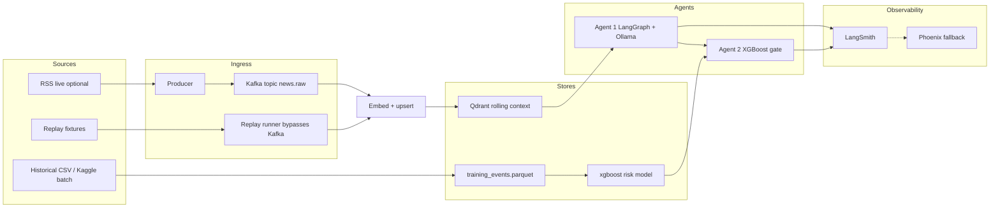

# AlphaGuard — Architecture (v1)

**Status:** Binding for implementation planning  
**Created:** 2026-07-12  
**Owner:** Tom  
**Lenses:** Senior AI Engineer (primary); Data Engineer; ML Engineer  

**SSOT vision:** [`VISION.md`](./VISION.md)  
**Program locks:** `second_brain/docs/2026-07-12_portfolio_vision_workspace_and_decisions.md`  
**First executable guide:** [`dev_guides/2026-07-12_dev_guide_01_replay_first_vertical_slice.md`](./dev_guides/2026-07-12_dev_guide_01_replay_first_vertical_slice.md)

This document defines components, data flow, contracts, failure modes, and layer boundaries. It does **not** authorize scope beyond VISION non-goals.

---

## 1. Purpose

AlphaGuard is a **bounded public interview lab**: one financial headline (live or replayed) flows through ingest → RAG → LangGraph Agent 1 (LLM analyst) → XGBoost Agent 2 (risk/regime gate) with LLMOps traces.

It is **not** a trading system, brokerage connector, or Lowd Capital surrogate.

---

## 2. Locked stack (do not reopen)

| Concern | Choice |
|---------|--------|
| Language | Python 3.11+ (`uv`) |
| Streaming | Apache Kafka via Docker Compose |
| Vector DB | Qdrant via Docker Compose |
| Orchestration | LangGraph |
| Local LLM | Host **Ollama**; default `gemma4:e2b`; fallback `qwen3.5:4b` via `OLLAMA_MODEL` |
| Embeddings | Local `sentence-transformers` (e.g. `all-MiniLM-L6-v2`) — separate from agent LLM |
| LLMOps | **LangSmith free default** + **Phoenix local fallback** |
| API | FastAPI (thin trigger / replay) |
| Agent 2 | **XGBoost** + scikit-learn |
| Sentiment features | **FinBERT batch offline only** (not concurrent with Kafka+Qdrant+Ollama on 16GB) |
| Prices / labels | yfinance |
| Agent 2 data | Option B ≈ **500** headline events; time-based split |
| Packaging | Compose for Kafka+Qdrant; app + Ollama on host |
| Sharing | Public GitHub + docs; **no Loom**; no required hosted demo |

**RAM operating rule:** Prefer sequential residency. Replay demos may stop unused containers. FinBERT runs offline in batch jobs only.

---

## 3. System overview



**Critical path for v1 credibility:** `Replay runner` → embed/upsert (or fixture context) → Agent 1 → Agent 2 → trace artifact.  
**Kafka is mandatory in the architecture and Compose file; it is optional for smoke.**

---

## 4. Components

| Component | Responsibility | Runs where |
|-----------|----------------|------------|
| `infra/compose` | Kafka + Qdrant (pinned images, healthchecks) | Docker |
| `ingest/producer` | Publish normalized news events to Kafka | Host |
| `ingest/consumer` | Consume → embed → upsert Qdrant | Host |
| `ingest/replay` | Load fixture event(s); **bypass live Kafka**; drive same downstream contracts | Host |
| `rag/` | Embedding + Qdrant query helpers; payload filters by ticker/time | Host |
| `agents/analyst` | LangGraph graph: retrieve → prompt → structured JSON → validate/retry | Host + Ollama |
| `agents/contracts` | Pydantic schemas shared by Agent 1 I/O and API | Host |
| `ml/features` | As-of feature builders (prices, optional FinBERT scores from batch table) | Host (batch) |
| `ml/train` | Build Option B dataset; train XGBoost; write model + metrics | Host (batch; FinBERT offline) |
| `ml/gate` | Load model; score Agent 1 proposal → approve/reject + risk_score | Host |
| `api/` | FastAPI: `/health`, `/replay`, optional `/trigger` | Host |
| `obs/` | LangSmith tracer wiring; Phoenix fallback switch | Host |
| `eval/` | Thin golden set (≥20): schema validity, gate determinism, basic retrieval presence | Host |
| `data/fixtures/` | Redistributable replay events + expected shapes | Git |
| `data/` derived | `training_events.parquet`, model artifacts — generated; large blobs not required in git | Local / CI |

---

## 5. Data flow

### 5.1 Replay path (default demo / smoke) — mandatory

1. Load one or more fixture events from `data/fixtures/` (JSON/JSONL).  
2. Optionally upsert fixture context docs into Qdrant **or** inject pre-baked retrieval hits (document which mode in config; prefer real Qdrant upsert when Compose is up).  
3. Run LangGraph Agent 1 with `OLLAMA_MODEL` (default `gemma4:e2b`).  
4. Validate Agent 1 JSON (Pydantic); on failure, **one** structured retry then fail closed.  
5. Build as-of features for the event timestamp (from fixture feature columns or live yfinance — smoke prefers fixture features).  
6. Agent 2 XGBoost → `approve` / `reject` + `risk_score`.  
7. Emit combined run record + LangSmith (or Phoenix) trace id / local span export.  
8. Exit non-zero on contract failure.

**Smoke must succeed with Kafka containers stopped** when `ALPHAGUARD_MODE=replay` (or equivalent). Qdrant may be required for the “real RAG” variant; if Qdrant is down, a documented `ALPHAGUARD_RAG_MODE=fixture` path still proves Agent 1→2 + obs.

### 5.2 Live path (optional after replay works)

1. RSS (or manual POST) → producer → Kafka `news.raw`.  
2. Consumer embeds + upserts Qdrant.  
3. Same Agent 1 → Agent 2 → obs path as replay.  

Do **not** block the vertical slice on live RSS reliability.

### 5.3 ML training path (batch; separate from demo RAM)

1. Ingest ~500 historical headlines (see §10 recommendation).  
2. Align tickers + event timestamps.  
3. Run FinBERT **offline batch** → sentiment column.  
4. Pull yfinance OHLCV; compute features **only from data available at event time `t`**.  
5. Label HIGH_RISK per VISION.  
6. Time-ordered 80/20 split; train XGBoost; log metrics.  
7. Persist model artifact consumed by `ml/gate`.

---

## 6. Contracts

### 6.1 News event (ingress + fixtures)

```json
{
  "event_id": "uuid-or-stable-hash",
  "headline": "string",
  "ticker": "AAPL",
  "source": "fixture|rss|kaggle|csv",
  "published_at": "2024-03-12T14:30:00Z",
  "url": "optional-string"
}
```

Rules: `ticker` ∈ locked universe `{AAPL, MSFT, NVDA, GOOGL, AMZN, META, SPY, QQQ}` for v1 training/demo unless explicitly extended. `published_at` is the as-of clock for all features.

### 6.2 Agent 1 proposal (LLM → gate)

```json
{
  "action": "BUY|SELL|HOLD|PASS",
  "ticker": "AAPL",
  "confidence": 0.0,
  "rationale": "string ≤ N chars",
  "event_id": "string"
}
```

Validation: enum + ticker format + `0 ≤ confidence ≤ 1` + non-empty rationale. Malformed → retry once with repair prompt → else error status (no silent coerce to HOLD without logging).

### 6.3 Agent 2 decision

```json
{
  "event_id": "string",
  "decision": "approve|reject",
  "risk_score": 0.0,
  "model_version": "string",
  "features_used": ["finbert_sentiment", "volatility_20d", "return_5d_prior", "return_20d_prior", "spy_return_5d"]
}
```

Agent 2 is a **regime/risk gate**, not an alpha model. It must **not** be trained on historical Agent 1 outputs (Option C deferred).

### 6.4 Training row (Option B parquet)

| Column | Meaning | Leakage rule |
|--------|---------|--------------|
| `event_id` | Stable id | — |
| `headline` | Text | Known at `t` |
| `ticker` | Symbol | Known at `t` |
| `published_at` | Event time | Clock |
| `finbert_sentiment` | Batch score | Computed from headline only |
| `volatility_20d` | Trailing vol ending at `t` | No bars after `t` |
| `return_5d_prior` | Return over `(t-5, t]` | No future |
| `return_20d_prior` | Return over `(t-20, t]` | No future |
| `spy_return_5d` | SPY context to `t` | No future |
| `label_high_risk` | 1 if fwd 5d ret `< -3%` OR vol ≥ train 90th pct | **Labels use future; features must not** |

Split: sort by `published_at`; first 80% train / last 20% test. No random shuffle.

### 6.5 Observability envelope

Every Agent 1/2 invocation records: `run_id`, `event_id`, model tags, latency, token usage when available, validation outcome, gate decision. Backend: LangSmith if `LANGCHAIN_API_KEY` (or current LangSmith env) present; else Phoenix local.

---

## 7. Module / layer map

Proposed package root: `src/alphaguard/` (exact name fixed at scaffold).

| Layer | May import | Must not import |
|-------|------------|-----------------|
| `contracts` | stdlib, pydantic | kafka, qdrant, ollama, ml training |
| `infra` adapters | clients only | agents, ml training |
| `ingest` | contracts, infra clients | agents.graph internals |
| `rag` | contracts, infra qdrant/embed | ml.train, fastapi routes |
| `agents` | contracts, rag query API, obs | kafka producer, ml.train |
| `ml` | contracts, feature libs | fastapi, langgraph graph wiring |
| `api` | agents façade, ingest.replay, ml.gate | raw kafka drivers in route handlers |
| `eval` | public façades / fixtures | private Lowd paths (none exist) |

**Forbidden globally:** brokerage APIs; Lowd Capital imports; cloud-managed Kafka as a v1 requirement; second LLM auditor agent; committing secrets.

**File size:** prefer ≤300 lines/file; hard max 400.

---

## 8. Failure modes

| Failure | Detect | Handle |
|---------|--------|--------|
| Kafka down / flaky | Healthcheck / produce timeout | Replay mode still green; live path fails with clear error |
| Qdrant down | Client ping | Replay may use `RAG_MODE=fixture`; document degraded mode |
| Ollama missing / wrong tag | Preflight `ollama list` | Fail fast with pull instructions; allow `OLLAMA_MODEL=qwen3.5:4b` |
| Malformed LLM JSON | Pydantic | One retry; then fail run (no fake approve) |
| FinBERT OOM with Compose+Ollama | Process monitor / policy | Never co-schedule; batch-only jobs |
| yfinance gaps / delisted days | Null features | Drop or impute per documented rule; never fill with future bars |
| Look-ahead in features | Code review + unit tests on as-of | Architecture + tests are the control |
| LangSmith unreachable | Tracer error | Auto-fallback Phoenix or local JSON trace dump |
| Empty retrieval | Zero hits | Agent 1 must still return valid JSON noting low context; gate still runs |
| Duplicate `event_id` replay | Idempotency key | Upsert by id; smoke remains deterministic |
| Model file missing | Gate load | Fail closed with “train first” message; fixtures may ship a tiny committed stub model for smoke only if labeled `fixture` |

---

## 9. Config and secrets

- `.env.example` lists all vars; no real keys in git.  
- Required for happy-path **replay**: `OLLAMA_MODEL=gemma4:e2b`, `ALPHAGUARD_MODE=replay`.  
- Optional: LangSmith key (free tier). Phoenix needs no cloud key.  
- Never log API keys or full `.env`.

---

## 10. Dataset source recommendation (U4 — propose, do not block)

**Recommendation (default):**

1. **Committed fixtures** (`data/fixtures/`): ≥20 redistributable synthetic or clearly redistributable headlines covering the 8-ticker universe — enough for smoke, eval, and interview demos.  
2. **Builder script** (`scripts/build_training_events.py` or `ml/build_dataset.py`): downloads or reads a **documented free CSV/Kaggle financial news archive** chosen at implement time; filters to ticker universe; samples/constructs **≈500** rows; joins yfinance + offline FinBERT; writes `data/training_events.parquet`.  
3. Do **not** require a paid news API for v1. Do **not** block architecture or the first guide on finalizing the exact Kaggle slug — record the chosen source in README when the builder lands.  
4. If license blocks committing raw headlines, commit **schema + builder + fixtures only**; reviewers run the builder locally.

This keeps Option B honest without inventing a proprietary corpus.

---

## 11. Testing strategy

| Layer | What |
|-------|------|
| Unit | Schema validation; as-of feature windowing; gate I/O mapping |
| Contract | Fixture event → Agent 1 JSON shape (may mock LLM in CI if no Ollama) |
| Smoke | `make smoke` / `uv run alphaguard replay` — **Kafka not required** |
| Integration (optional local) | Compose up → consumer path once replay is green |
| Eval | ≥20 golden cases: schema pass rate; retrieval non-empty when Qdrant seeded; gate deterministic given fixed features |
| Arch tests | After package layout exists: 1–2 import-boundary rules |

CI should prefer replay/fixture + mocked LLM where runners lack Ollama/GPU RAM.

---

## 12. Observability

- Default tracer: LangSmith.  
- Fallback: Phoenix local (or file-backed span dump if Phoenix not installed — document primary fallback as Phoenix).  
- Required artifacts for portfolio: checked-in screenshots under `docs/assets/` (or similar) from a successful replay.  
- No Loom. No required hosted demo URL.

---

## 13. Non-goals (architecture-enforced)

- Live trading / paper brokerage / exchange execution  
- Proprietary alpha or Lowd Capital logic  
- Cloud Kafka / full cloud deploy  
- Second LLM agent as risk auditor  
- Fine-tuning / MLflow registry / K8s / Terraform  
- Multimodal Gemma inputs (text-only Agent 1)  
- Training Agent 2 on Agent 1 historical outputs  
- Requiring FinBERT resident during demo  

---

## 14. Build sequencing (architecture view)

1. **Replay-first vertical slice** (this program’s first guide) — contracts, fixtures, replay runner, Agent 1, stub-or-trained gate, obs, smoke.  
2. Compose Kafka+Qdrant wiring proven against the same contracts.  
3. Option B dataset builder + FinBERT batch + XGBoost train.  
4. Thin eval harness + packaging docs (README, GETTING_STARTED, INTERVIEW).  
5. Optional live RSS producer — only after replay smoke is green.

---

## 15. QUALITY self-check (this doc)

- [x] Locked stack enforced; locked decisions not reopened  
- [x] Replay bypass of live Kafka mandated  
- [x] Edge cases and failure modes listed  
- [x] Blast radius: 16GB RAM, leakage, scope creep, Lowd separation  
- [x] U4 dataset recommendation recorded without blocking  
- [x] No application code in this stage  
