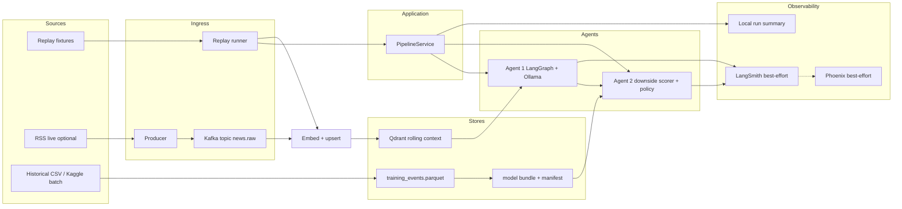

# AlphaGuard — Architecture (v1)

**Status:** Binding contracts SSOT — **bounded MV build complete** (guides 01–08; 05a/05b Option B lab; 06 thin RSS; 07 LangSmith + 08 Phoenix real fail-open spans); production hardening / deeper live eval incomplete; finish line = local + CI; default smoke still `bundle_kind=fixture`  
**Created:** 2026-07-12  
**Last Updated:** 2026-07-21 (Align finish-line wording + finance honesty cross-link; default smoke still fixture)  
**Owner:** Tom  
**Lenses:** Senior AI Engineer (primary); Data Engineer; ML Engineer; Quant (leakage / label honesty)

**Product / why SSOT:** [`VISION.md`](./VISION.md) (must stay aligned with AG1–AG3)  
**Contracts / how SSOT:** this file  
**Finance claims:** [`FINANCE_HONESTY.md`](./FINANCE_HONESTY.md)  
**Program locks:** `second_brain/docs/2026-07-12_portfolio_vision_workspace_and_decisions.md` (**AG1–AG3**)  
**Pass-3 review:** `second_brain/docs/2026-07-12_alphaguard_architecture_pass3_review.md`  
**First executable guide:** [`dev_guides/2026-07-12_dev_guide_01_replay_first_vertical_slice.md`](./dev_guides/2026-07-12_dev_guide_01_replay_first_vertical_slice.md) — **Implement complete / Review shippable**

This document defines components, data flow, contracts, failure modes, and layer boundaries. It does **not** authorize scope beyond VISION non-goals. **Do not read the component table as “all code exists”** — see §5 existence column.

---

## 1. Purpose

AlphaGuard is a **bounded public interview lab**: one financial headline (live or replayed) flows through ingest → RAG → LangGraph Agent 1 (LLM analyst) → XGBoost Agent 2 (event **downside-risk scorer** + deterministic gate policy) with LLMOps traces.

It is **not** a trading system, brokerage connector, Lowd Capital surrogate, or ranking-product showcase. Agent 1 RAG is **simple top-k with as-of filtering** — no hybrid fusion requirement and **no neural reranker**.

---

## 2. Locked stack (do not reopen)

| Concern | Choice |
|---------|--------|
| Language | Python 3.11+ (`uv`) |
| Streaming | Apache Kafka via Docker Compose |
| Vector DB | Qdrant via Docker Compose |
| Orchestration | LangGraph |
| Local LLM | Host **Ollama**; default `gemma4:e2b`; fallback `qwen3.5:4b` via `OLLAMA_MODEL` |
| Embeddings | Local `sentence-transformers` (e.g. `all-MiniLM-L6-v2`) — separate from agent LLM |
| LLMOps | **LangSmith free default** (Guide 07: real fail-open spans when configured) + **Phoenix local fallback** (Guide 08: real fail-open OTEL chain span when `PHOENIX_ENABLED`); **local run summary always required** |
| API | FastAPI (thin trigger / replay) |
| Agent 2 | **XGBoost** downside-risk scorer + scikit-learn; deterministic approve/reject policy |
| Sentiment features | **FinBERT batch offline only** (not concurrent with Kafka+Qdrant+Ollama on 16GB) |
| Prices / labels | yfinance; labels = **forward downside return only** (AG2) |
| Agent 2 data | Option B ≈ **500** headline events; time-based split **before** threshold fit |
| Packaging | Compose for Kafka+Qdrant; app + Ollama on host |
| Sharing | Public GitHub + docs; **no Loom**; no required hosted demo |

**RAM operating rule:** Prefer sequential residency. Replay demos may stop unused containers. FinBERT runs offline in batch jobs only. See §16 resource mode matrix.

**Portfolio ranking note:** Mechanic/AI KB own hybrid retrieval + RRF. AlphaGuard does **not** — keep Agent 1 retrieval simple.

---

## 3. Locked product decisions (AG1–AG3 — do not reopen)

| ID | Lock |
|----|------|
| **AG1** | XGBoost = event **downside-risk scorer**. v1 Agent 1 actions = `BUY \| HOLD \| PASS` only (`SELL` unsupported). A **deterministic policy** maps `(action, downside_risk_score[, optional vol veto]) → approve \| reject`. |
| **AG2** | Learned label = **forward downside return only**. `volatility_20d` is a **predictor** and/or an explicit **deterministic veto outside** the learned target — never a branch of the training label. **Split first**, then fit any score/vol thresholds on **training rows only**. |
| **AG3** | Unified as-of: event times in **UTC**; **exchange-calendar** interpretation; features use only the **last fully completed market session** at/before event time; every feature row records `feature_as_of`; every retrieval hit has `available_at` and must satisfy `available_at <= event.published_at`. |

---

## 4. System overview



**Critical path for v1 credibility:** `Replay runner` → `PipelineService` → embed/upsert (or fixture `RetrievalHit`s) → Agent 1 → Agent 2 policy → local run summary (+ LangSmith/Phoenix real spans when configured).  
**Kafka is mandatory in the architecture and Compose file; it is optional for smoke.**

---

## 5. Components

| Component | Responsibility | Existence (2026-07-13) | Runs where |
|-----------|----------------|------------------------|------------|
| `infra/compose` | Kafka + Qdrant (pinned images, healthchecks) | **Present** (`docker-compose.yml`) | Docker |
| `ingest/producer` | Publish normalized news events to Kafka | **Present** (`ingest/producer.py` → `news.raw`) | Host |
| `ingest/consumer` | Consume → validate → embed → upsert Qdrant | **Present** (`ingest/consumer.py`; DLQ `news.raw.dlq`) | Host |
| `ingest/rss_*` | Yahoo RSS fetch/normalize/poll → produce | **Present** (Guide 06; optional operator path; smoke does not require) | Host |
| `ingest/replay` | Load fixture event(s); **bypass live Kafka**; call `PipelineService` | **Present** | Host |
| `pipeline/` | **`PipelineService`**: single orchestration façade for replay / API / future Kafka consumer | **Present** | Host |
| `rag/` | Embedding + Qdrant query; **as-of filter**; returns `RetrievalHit[]` (simple top-k). Called by **`PipelineService` only** for the run path | **Present** (fixture + qdrant modes) | Host |
| `agents/analyst` | LangGraph: **consume** preloaded `RetrievalHit[]` from graph state → prompt → structured JSON → validate/retry. Must **not** open a second retrieve path unless it calls the same `rag/` API with the same event clock | **Present** | Host + Ollama |
| `contracts/` | Top-level Pydantic schemas (events, proposals, hits, decisions, run envelope, model manifest) | **Present** | Host |
| `ml/features` | Unified as-of feature builders; emit `feature_as_of` | **Present** (fixture path; not full yfinance builder) | Host (batch / smoke fixtures) |
| `ml/train` | Option B dataset; train XGBoost **downside scorer**; write **model bundle + manifest** | **05a builder + 05b train landed** (`train_option_b_gate.py` → `model_bundle_option_b/`); fixture bundle remains default smoke | Host (batch; FinBERT offline) |
| `ml/gate` | Load bundle; score downside risk; apply **deterministic policy** → approve/reject | **Present** | Host |
| `api/` | FastAPI: `/health`, `/replay`, `/trigger` — thin wrappers over `PipelineService` | **Present** | Host |
| `obs/` | Always write local run summary; LangSmith/Phoenix as fail-open adapters | **Present** — local envelope real; LangSmith = **real fail-open spans** when tracing+key (Guide 07); Phoenix = **real fail-open spans** when `PHOENIX_ENABLED` (Guide 08) | Host |
| `eval/` | Golden set (≥21 executed): schema, identity, as-of, gate (incl. tmp vol-veto), OOU (NewsEvent + fixture-path) | **Present** — `eval/golden_cases.jsonl` + `src/alphaguard/eval/` harness; unit tests remain | Host |
| `data/fixtures/` | Redistributable replay events, retrieval sidecars, fixture model bundle | **Present** | Git |
| `data/` derived | `training_events.parquet`, Option B model bundles — generated; large blobs not required in git | **Builder + train paths ready** (`data/derived/`); committed parquet/bundle **not** required | Local / CI |

**Package naming (AG-P2-1 resolved):** top-level `contracts/` only. Do not nest a second `agents/contracts` package.

---

## 6. Data flow

### 6.1 Replay path (default demo / smoke) — mandatory

1. Load one or more fixture events from `data/fixtures/` (JSON/JSONL).  
2. `PipelineService.run(event, mode=...)` owns ordering, retries, tracing correlation, and terminal status.  
3. **Retrieval ownership (single choke point):** `PipelineService` loads as-of-filtered `RetrievalHit[]` **once** via the `rag/` API (Qdrant upsert/query with **mandatory** `available_at <= published_at`, or fixture hits that already obey that rule) and injects them into Agent 1 graph state. Agent 1 **consumes** those hits and must not re-query a divergent path. Prefer real Qdrant upsert when Compose is up.  
4. Run LangGraph Agent 1 with `OLLAMA_MODEL` (default `gemma4:e2b`).  
5. Validate Agent 1 JSON (Pydantic); on failure, **one** structured retry then fail closed.  
6. **Application** stamps `event_id` and `ticker` from the input event onto the proposal (LLM values for those fields are ignored or rejected if present and mismatched — see §7.2).  
7. Build as-of features per §8; smoke prefers fixture feature columns.  
8. Agent 2: XGBoost → `downside_risk_score` (`proba_high_risk`) → deterministic policy → `approve` / `reject`.  
9. Persist **local run summary** (success or structured error). Emit LangSmith Client runs when configured (Guide 07); emit Phoenix OTEL chain spans when `PHOENIX_ENABLED` (Guide 08); tracer failure must not flip a valid pipeline result.  
10. Exit non-zero on contract failure.

**Smoke must succeed with Kafka containers stopped** when `ALPHAGUARD_MODE=replay`. Qdrant may be required for the “real RAG” variant; if Qdrant is down, documented `ALPHAGUARD_RAG_MODE=fixture` still proves Agent 1→2 + local summary.

### 6.2 Live path (optional after replay works)

1. RSS (`alphaguard rss poll`) or manual POST → producer → Kafka `news.raw`.  
2. Consumer durable handle = validate + embed + idempotent Qdrant upsert via `PipelineService.ingest_event` only (Guide 04). **Full Agent 1→2 is not invoked on consume** — use `/replay` (or a later slice) for the agent path.  
3. Guide 06 ships a **thin** Yahoo RSS operator path (one-shot + optional demo `--loop`, N=10, retries). Yahoo may flake; offline XML fixtures are CI truth. This is **not** 24/7 production reliability.  
4. Obs / gate path remains the replay `PipelineService.run` path until an explicit later guide wires agent-on-consume.

Do **not** block smoke on live RSS. Full Kafka delivery contract is specified in §17 — smoke stays Kafka-down.

### 6.3 ML training path (batch; separate from demo RAM)

1. Ingest ~500 historical headlines (U4 locked: Kaggle `miguelaenlle/massive-stock-news-analysis-db-for-nlpbacktests` — see `docs/TRAINING_DATA.md`).  
2. Align tickers + event timestamps (UTC).  
3. Run FinBERT **offline batch** → sentiment column.  
4. Pull yfinance OHLCV; compute features under §8 as-of rules; record `feature_as_of` per row.  
5. **Time-ordered split first** (80/20 by `published_at`).  
6. Label on **training and test** using forward downside return only (AG2); fit any score threshold / optional vol-veto threshold on **train only**, then apply frozen thresholds to test.  
7. Train XGBoost downside scorer; write **model bundle + manifest** (§7.6).  
8. `ml/gate` loads the bundle at inference.

---

## 7. Contracts

### 7.1 News event (ingress + fixtures)

```json
{
  "event_id": "uuid-or-stable-hash",
  "headline": "string",
  "ticker": "AAPL",
  "source": "fixture|rss|kaggle|csv",
  "published_at": "2024-03-12T14:30:00Z",
  "url": "optional-string"
}
```

Rules:
- `ticker` ∈ locked universe `{AAPL, MSFT, NVDA, GOOGL, AMZN, META, SPY, QQQ}` for v1 training/demo. **Reject out-of-universe tickers** in training builders and fixtures (do not silently remap).
- **Documented training-ingest archive aliases** (not silent remap; not live ingress): `fb_meta_v1` (`FB`→`META`), `goog_googl_v1` (`GOOG`→`GOOGL`) in `ml/dataset_ingest.py` — provenance + fail-closed price identity (fetch universe ticker only). Fixtures / RSS / `NewsEvent` still reject raw `FB`/`GOOG`.
- `published_at` is UTC and is the **event clock** for as-of and retrieval filtering (AG3).

### 7.2 Agent 1 proposal (LLM → gate)

**Supported v1 actions (AG1):** `BUY | HOLD | PASS` only. `SELL` is **unsupported** — schema reject (or repair prompt that forbids SELL); never silently map to another action.

```json
{
  "action": "BUY|HOLD|PASS",
  "confidence": 0.0,
  "rationale": "string",
  "event_id": "string",
  "ticker": "string"
}
```

Validation:
- Enum + `0 ≤ confidence ≤ 1` + non-empty rationale with **hard max 2000 chars**.
- Malformed → retry once with repair prompt → else structured error (no silent coerce to HOLD/PASS without logging).
- **Identity ownership:** `PipelineService` (or gate façade) **overwrites** `event_id` and `ticker` from the input `NewsEvent` before scoring. If the LLM emits different values, log `identity_mismatch` and still use the input event’s identity (do not score the wrong event’s features).

### 7.3 RetrievalHit (RAG contract — AG3)

Every context item Agent 1 sees must be a `RetrievalHit`:

```json
{
  "document_id": "string",
  "text": "string",
  "ticker": "AAPL",
  "available_at": "2024-03-12T13:00:00Z",
  "source": "qdrant|fixture",
  "score": 0.0
}
```

Rules:
- `available_at` is required (UTC).
- Query path **must** filter `available_at <= event.published_at`. Hits that violate the filter are dropped before prompting; tests must prove future news cannot enter context.
- v1 retrieval = **simple top-k** (vector similarity + as-of filter + optional ticker payload filter). No RRF, no hybrid lexical fusion requirement, **no neural reranker**.

### 7.4 Agent 2 decision (downside scorer + policy — AG1)

XGBoost emits a **downside risk score**, not an action. **Score kind (binding):** `downside_risk_score` = `proba_high_risk` = `predict_proba[:, 1]` for the high-risk class (`label_high_risk=1`). Do not use raw margin or uncalibrated decision_function as the policy input in v1.

The gate policy is deterministic and code-owned:

```json
{
  "event_id": "string",
  "ticker": "string",
  "action": "BUY|HOLD|PASS",
  "downside_risk_score": 0.0,
  "decision": "approve|reject",
  "decision_reason": "string",
  "model_version": "string",
  "bundle_id": "string",
  "features_used": ["finbert_sentiment", "volatility_20d", "return_5d_prior", "return_20d_prior", "spy_return_5d"],
  "feature_as_of": "2024-03-11",
  "policy_version": "v1"
}
```

**v1 deterministic policy (binding):**

| Action | Policy |
|--------|--------|
| `BUY` | `reject` if `downside_risk_score >= score_threshold` **or** optional train-fitted vol veto fires; else `approve` |
| `HOLD` | Always `approve` (no directional exposure to veto); still record score for traces/interview story |
| `PASS` | Always `approve` (no trade proposed); still record score |

**Threshold fitting (binding):** After the time-ordered split, choose `score_threshold` on **train only** by maximizing **train F1** for `label_high_risk` against `proba_high_risk >= threshold`. Freeze that threshold into the bundle manifest; evaluate test with the frozen value. Optional `vol_veto_threshold` (if enabled) is likewise fit on train only (e.g. train 90th percentile of `volatility_20d` among train rows) and frozen.

Optional vol veto: if enabled in the model bundle, `volatility_20d >= vol_veto_threshold` rejects `BUY` only. This veto is **policy**, not part of the learned label (AG2).

**`confidence` (Agent 1):** Validated for schema completeness, then **ignored by policy** — trace / interview signal only. Do not invent confidence-weighted thresholds in v1.

Agent 2 is a **regime / downside-risk gate**, not an alpha model. It must **not** be trained on historical Agent 1 outputs (Option C deferred).

### 7.5 Training row (Option B parquet — AG2)

| Column | Meaning | Leakage / honesty rule |
|--------|---------|------------------------|
| `event_id` | Stable id | — |
| `headline` | Text | Known at `t` |
| `ticker` | Symbol | Known at `t` |
| `published_at` | Event time (UTC) | Clock |
| `feature_as_of` | Last completed session used for price features | §8 |
| `finbert_sentiment` | Batch score | Headline only |
| `volatility_20d` | Trailing vol ending at `feature_as_of` | **Predictor only** — not a label branch |
| `return_5d_prior` | Return over prior window ending at `feature_as_of` | No future |
| `return_20d_prior` | Return over prior window ending at `feature_as_of` | No future |
| `spy_return_5d` | SPY context to `feature_as_of` | No future |
| `fwd_return_5d` | Forward 5-trading-day return after event session | **Label input only; never a feature** |
| `label_high_risk` | `1` iff `fwd_return_5d < -0.03` else `0` | **Forward downside only** (AG2) |

**Removed from label:** any OR-branch on `volatility_20d` percentile. Volatility may still appear as a feature and/or as a deterministic BUY veto outside the learned target.

**Split / threshold order (binding):**
1. Sort by `published_at`; first 80% train / last 20% test. **No random shuffle.**
2. Fit `score_threshold` on **train only** by maximizing train F1 on `proba_high_risk` (§7.4); fit optional `vol_veto_threshold` on train only.
3. Freeze thresholds + `score_kind` + `label_window` into the model bundle manifest; evaluate test with frozen values.

### 7.6 Model bundle manifest (AG-P1-4)

A loadable gate artifact is a **directory/bundle**, not a lone `.json` score string. Required `manifest.json` fields:

| Field | Purpose |
|-------|---------|
| `bundle_id` | Stable id |
| `model_version` | Semver or date tag |
| `bundle_kind` | `fixture` \| `option_b` |
| `feature_names` | Ordered list — scoring must use this order |
| `feature_dtypes` / preprocessing notes | Enough to prevent silent skew |
| `score_kind` | `proba_high_risk` (XGBoost `predict_proba[:,1]`) |
| `score_threshold` | Train-fitted downside threshold (train-F1 max) |
| `threshold_fitting` | e.g. `train_f1_max` |
| `vol_veto_enabled` | bool |
| `vol_veto_threshold` | Present if enabled; train-fitted |
| `policy_version` | e.g. `v1` matching §7.4 |
| `label_definition` | `"fwd_return_5d < -0.03"` |
| `label_window` | `{ "start": "first_completed_session_close_at_or_after_event_session", "end": "close_5_trading_sessions_later" }` |
| `train_window` | `{ "start": "...", "end": "..." }` |
| `dataset_hash` | Hash of training parquet or fixture rows |
| `dataset_source` | Fixture path or documented U4 source id |
| `metrics` | Train/test metrics actually computed |
| `library_versions` | e.g. `xgboost`, `sklearn`, python |
| `created_at` | UTC timestamp |

Gate load **fails closed** if manifest missing, `feature_names` mismatch, or `bundle_kind` incompatible with the requested mode (e.g. claiming Option B metrics while loading a fixture stub).

### 7.7 Pipeline run envelope (success / error / degraded)

Every `PipelineService.run` writes a local artifact under `artifacts/runs/` (gitignored), shape:

```json
{
  "run_id": "uuid",
  "status": "success|error|degraded",
  "event_id": "string",
  "ticker": "string",
  "mode": "replay|live",
  "rag_mode": "fixture|qdrant",
  "resource_mode": "replay_fixture|replay_qdrant|kafka_integration|finbert_train",
  "proposal": {},
  "decision": {},
  "retrieval_hit_count": 0,
  "obs": {
    "local_summary_path": "string",
    "langsmith": "ok|skipped|failed",
    "phoenix": "ok|skipped|failed"
  },
  "error": {
    "code": "string",
    "message": "string",
    "retriable": false
  },
  "started_at": "ISO-8601",
  "finished_at": "ISO-8601"
}
```

- `success`: contracts valid; gate ran; local summary written.  
- `error`: validation failure after retry, missing model, Ollama down, etc. — non-zero exit for smoke.  
- `degraded`: pipeline result valid but a non-critical subsystem failed (e.g. LangSmith unreachable) — smoke may still exit 0 if contracts held.  
- Telemetry adapters are **fail-open** relative to pipeline correctness (DF-6).

### 7.8 Observability fields

Every Agent 1/2 invocation records: `run_id`, `event_id`, model/bundle tags, latency, token usage when available, validation outcome, `downside_risk_score`, gate decision, `feature_as_of`.  
**Baseline:** local run summary (mandatory).  
**Adapters:** LangSmith emits real Client runs when tracing+key configured (Guide 07); Phoenix emits a real OpenInference chain span when `PHOENIX_ENABLED` (Guide 08). Failures recorded in envelope; do not rewrite a valid decision.

---

## 8. Unified as-of policy (AG3)

Binding rules for prices, labels, and retrieval:

1. **Clock:** `event.published_at` normalized to **UTC**.  
2. **Calendar:** Interpret sessions with the **US equity exchange calendar** (NYSE) for the locked ticker universe.  
3. **Completed session only:** Price features may use bars only through the **last fully completed regular session** at or before `published_at`.  
   - Example: a Tuesday 10:00 ET headline must **not** use Tuesday’s daily close (that bar is incomplete / future relative to the headline). Use Monday’s completed session (or prior) as `feature_as_of`.  
4. **Record:** Every feature vector includes `feature_as_of` (date of last completed session used).  
5. **Adjusted prices:** Prefer split/dividend-adjusted closes from yfinance for return/vol features; document the series used in the training README when Option B lands. Do not mix adjusted/unadjusted within one bundle.  
6. **Forward label (binding session bounds):** Features use the last **completed** session at/before the event (`feature_as_of`). `fwd_return_5d` = return from the **first completed session close at or after** the event’s calendar session to the close **5 trading sessions later**. Labels **may** use post-event closes; features **must not**. Same-bar peek into a close unavailable at headline time is forbidden for features. Record this window as `label_window` in the bundle manifest.  
7. **Retrieval:** Every `RetrievalHit.available_at <= event.published_at` (strict filter in code + tests).  
8. **Fixtures:** Fixture sidecars must include honest `available_at` / `feature_as_of` values; synthetic fixtures may use simplified calendars but must not teach implementers to ignore the filter.

Unit tests for as-of windowing and retrieval filtering are **P0** — not optional polish.

---

## 9. Module / layer map

Package root (implemented): `src/alphaguard/`.

| Layer | May import | Must not import |
|-------|------------|-----------------|
| `contracts` | stdlib, pydantic | kafka, qdrant, ollama, ml training |
| `infra` adapters | clients only | agents, ml training, pipeline policy |
| `ingest` | contracts, infra clients, pipeline façade | agents.graph internals |
| `rag` | contracts, infra qdrant/embed | ml.train, fastapi routes |
| `pipeline` | contracts, rag query API, agents façade, ml.gate, obs | raw kafka drivers; bypass of as-of filters |
| `agents` | contracts, rag query API, obs | kafka producer, ml.train, overwrite of as-of rules |
| `ml` | contracts, feature libs | fastapi, langgraph graph wiring |
| `api` | pipeline façade only | raw kafka drivers; duplicate orchestration |
| `eval` | public façades / fixtures | private Lowd paths (none exist) |

**Forbidden globally:** brokerage APIs; Lowd Capital imports; cloud-managed Kafka as a v1 requirement; second LLM auditor agent; neural rerankers; committing secrets; training labels that OR in current volatility.

**File size:** prefer ≤300 lines/file; hard max 400.

---

## 10. Failure modes

| Failure | Detect | Handle |
|---------|--------|--------|
| Kafka down / flaky | Healthcheck / produce timeout | Replay mode still green; live path fails with clear error |
| Qdrant down | Client ping | Replay may use `RAG_MODE=fixture`; document degraded mode |
| Ollama missing / wrong tag | Preflight `ollama list` | Fail fast with pull instructions; allow `OLLAMA_MODEL=qwen3.5:4b` |
| Malformed LLM JSON | Pydantic | One retry; then fail run (no fake approve) |
| LLM emits `SELL` | Schema | Reject / repair; never approve a SELL path in v1 |
| LLM identity mismatch | Compare to input event | Overwrite with input `event_id`/`ticker`; log warning |
| Future retrieval hit | `available_at` filter | Drop hit; if zero hits remain, Agent 1 must still emit valid JSON noting low context |
| FinBERT OOM with Compose+Ollama | Process monitor / policy | Never co-schedule; batch-only jobs |
| yfinance gaps / delisted days | Null features | Drop or impute per documented rule; never fill with future bars |
| Look-ahead in features | Code review + unit tests on as-of | §8 + tests are the control |
| LangSmith / Phoenix unreachable | Tracer error | Record in envelope; keep local summary; do not fail valid pipeline |
| Empty retrieval | Zero hits after as-of filter | Agent 1 still returns valid JSON; gate still runs |
| Duplicate `event_id` replay | Idempotency key | Upsert by id; smoke remains deterministic |
| Model / manifest missing or skew | Gate load | Fail closed with actionable message; fixture bundles labeled `bundle_kind=fixture` |
| Circular / tautological metrics | Bundle audit | Refuse label defs that include `volatility_20d` as target branch |

---

## 11. Dataset source recommendation (U4 — propose, do not block replay)

**Recommendation (default):**

1. **Committed fixtures** (`data/fixtures/`): ≥20 redistributable synthetic or clearly redistributable headlines covering the 8-ticker universe — enough for smoke, eval, and interview demos. Include `available_at` on retrieval sidecars and `feature_as_of` on feature rows.  
2. **Builder script** (`scripts/build_training_events.py` + `src/alphaguard/ml/dataset_build.py`): **landed Guide 05a** — Kaggle archive → filter/dedup/sample → yfinance as-of + offline FinBERT → `data/derived/training_events.parquet`. See `docs/TRAINING_DATA.md`.  
3. Do **not** require a paid news API for v1. Do **not** block architecture or the first guide on finalizing the exact Kaggle slug — record the chosen source in README when the builder lands.  
4. If license blocks committing raw headlines, commit **schema + builder + fixtures only**; reviewers run the builder locally.  
5. **Hard gate for Option B training guide only:** U4 source locked (pass 60) + builder (05a) + train (05b) authorized. Fixtures remain unblocked.

---

## 12. Testing strategy

| Layer | What |
|-------|------|
| Unit | Schema validation; **as-of completed-session rules**; retrieval future-hit rejection; gate policy table for BUY/HOLD/PASS; identity overwrite; **hard-fail** on future `available_at`, accepted `SELL`, skipped identity overwrite, and gate-table mismatches |
| Contract | Fixture event → Agent 1 JSON shape (may mock LLM in CI); no `SELL` accepted |
| Smoke | `make smoke` / `uv run alphaguard replay` — **Kafka not required** |
| Integration (optional local) | Compose up → consumer path once replay is green (later slice) |
| Eval | ≥21 **executed** goldens: structural schema ok/reject; identity preservation; as-of/retrieval invariants; gate determinism + tmp-manifest vol-veto; OOU (NewsEvent + fixture-path). Numeric LLM schema-pass rate deferred until live-Ollama eval. Do **not** inflate fixture-bundle gate metrics into Option B claims |
| Arch tests | After package layout exists: 1–2 import-boundary rules; pipeline is sole orchestrator and sole retrieval owner for the run path |

**Honesty rule:** A fixture `bundle_kind=fixture` proving smoke plumbing is **not** evidence that the Option B downside model generalizes. Option B metrics live in a locally trained `bundle_kind=option_b` manifest (lab-scale; noisy — weak/zero test F1 is allowed and must not be hidden). Status language: **bounded MV build complete; production hardening and deeper live evaluation incomplete** — not “production risk model” / not interview fluency. See [`FINANCE_HONESTY.md`](./FINANCE_HONESTY.md).

CI should prefer replay/fixture + mocked LLM where runners lack Ollama/GPU RAM.

---

## 13. Observability

- **Mandatory baseline:** local run summary / error envelope (§7.7) — **implemented** (`obs/summary.py` → `artifacts/runs/`).  
- **LangSmith (Guide 07):** when `LANGSMITH_TRACING=true` and a non-empty `LANGSMITH_API_KEY` are set, `obs/langsmith_adapter.py` emits a real Client run (`create_run` / `update_run`). `obs.langsmith=ok` **only after** emit succeeds; otherwise `skipped` (off/empty key) or `failed` (SDK/network). Successful emit stores `extras.langsmith_run_id`. Default smoke/CI never requires a key (`skipped`).  
- **Phoenix (Guide 08):** when `PHOENIX_ENABLED=true`, `obs/phoenix_adapter.py` emits one OpenInference **chain** span via `arize-phoenix-otel` (`phoenix.otel.register` + manual span + `force_flush`). `obs.phoenix=ok` **only after** emit+flush succeeds; otherwise `skipped` (off) or `failed` (SDK/network/flush). Successful emit stores `extras.phoenix_span_id`. Default smoke/CI never requires a Phoenix collector (`skipped`). Thin one-span path — not full auto-instrument / dual-backend maturity theater.  
- Telemetry failure **must not** change a valid approve/reject outcome (fail-open; success + adapter `failed` → envelope `degraded`).  
- Required portfolio artifacts: checked-in **local-envelope** screenshots under `docs/assets/` (Guide 02) — **present**. LangSmith/Phoenix UI screenshots are optional and **not** required for Guide 07/08 DoD.  
- No Loom. No required hosted demo URL.

---

## 14. Non-goals (architecture-enforced)

- Live trading / paper brokerage / exchange execution  
- Proprietary alpha or Lowd Capital logic  
- Cloud Kafka / full cloud deploy  
- Second LLM agent as risk auditor  
- Fine-tuning / MLflow registry / K8s / Terraform  
- Multimodal Gemma inputs (text-only Agent 1)  
- Training Agent 2 on Agent 1 historical outputs  
- Requiring FinBERT resident during demo  
- **`SELL` proposals in v1** (AG1)  
- **Volatility as a learned-label branch** (AG2)  
- **Neural reranker / hybrid RRF ranking showcase** for Agent 1 RAG  
- **Confidence-weighted gate thresholds** (confidence is trace-only)  
- Claiming Kafka DE maturity from smoke alone  

---

## 15. Build sequencing (architecture view)

1. **Replay-first vertical slice** (first guide) — contracts (incl. RetrievalHit, run envelope, fixture bundle manifest), fixtures, `PipelineService`, Agent 1 (`BUY|HOLD|PASS`), downside scorer + policy gate, local obs, smoke.  
2. Compose Kafka+Qdrant wiring proven against the same contracts (delivery contract §17).  
3. Option B **dataset builder** (05a) + **XGBoost train** (05b) landed; default smoke still fixture.  
4. Thin eval harness + packaging docs (README, GETTING_STARTED, INTERVIEW).  
5. Optional live RSS producer — **Guide 06 thin path landed** (`rss poll`); agent-on-consume still deferred.

---

## 16. Resource mode matrix (AG-P1-7)

| Mode | Kafka | Qdrant | Ollama | FinBERT | Purpose | `/health` expectation |
|------|-------|--------|--------|---------|---------|------------------------|
| `replay_fixture` | Down | Down OK | Up | Down | Default smoke | App + Ollama OK; infra deps reported skipped |
| `replay_qdrant` | Down | Up | Up | Down | Real RAG demo | App + Ollama + Qdrant OK |
| `kafka_integration` | Up | Up | Up | Down | Guide 04 DE slice | Kafka + Qdrant + Ollama OK in `/health` |
| `finbert_train` | Prefer down | Prefer down | Prefer down | Up | Batch feature/label build | Training job health only; do not co-schedule with full demo stack |

`/health` must report per-dependency status so reviewers can distinguish intentional degradation from an untested stack. Smoke defaults to `replay_fixture` unless config flips RAG mode.

---

## 17. Kafka delivery contract (Guide 04 — thin integration; not smoke)

Implemented (Guide 04):

- Topic **`news.raw`**; DLQ **`news.raw.dlq`**; consumer group **`alphaguard-news-raw`**
- Flat JSON payload `payload_version="1"`; key = `event_id`
- At-least-once delivery; consumer commits offset **only after** `PipelineService.ingest_event` succeeds (or poison committed after successful DLQ)
- Bounded failed durable-handle attempts (**3** / `MAX_ATTEMPTS`) then DLQ; poison commit after successful DLQ produce
- On durable-handle failure: **seek** back to the failed offset and stop the poll batch — never commit past an unhandled record
- Idempotent Qdrant upsert via **UUID5** point id (`alphaguard:event:{event_id}`) — not Python `hash()`
- Thin **`POST /trigger`** produces to `news.raw` (not a second orchestrator)
- **`resource_mode=kafka_integration`** when `ALPHAGUARD_MODE=live` + `ALPHAGUARD_RAG_MODE=qdrant`

Do **not** expand smoke to require this. Guide 06 adds optional Yahoo RSS → produce; still **not** 24/7 reliability, **not** agent-on-consume, **not** v1 Done.
**Compose proof (2026-07-15):** `bitnamilegacy/kafka:3.9.0` + `qdrant/qdrant:v1.13.2` healthy; `ALPHAGUARD_RUN_KAFKA_TESTS=1 uv run pytest -m kafka_integration` → **3 passed** (happy produce→consume→Qdrant upsert; redelivery idempotent; poison→DLQ via seek loop). Default `uv run pytest -q` still excludes the marker (smoke Kafka-down).

---

## 18. QUALITY self-check (this doc)

- [x] Locked stack enforced; AG1–AG3 locked and reflected in contracts  
- [x] Replay bypass of live Kafka mandated  
- [x] Downside-risk scorer + deterministic policy; forward-return-only labels; split-before-threshold  
- [x] Unified as-of + `RetrievalHit` + `feature_as_of` + locked `fwd_return_5d` session bounds  
- [x] `PipelineService` sole retrieval owner + run envelope; application owns identity fields  
- [x] `score_kind=proba_high_risk` + train-F1 threshold fitting in §7.4/§7.6  
- [x] Model bundle manifest; resource mode matrix; Kafka later-slice contract sketched  
- [x] Ranking non-goal stated (simple top-k; no neural reranker)  
- [x] Edge cases and failure modes listed  
- [x] Blast radius: 16GB RAM, leakage, label honesty, scope creep, Lowd separation  
- [x] U4 dataset recommendation recorded without blocking replay  
- [x] No application code in this stage  
- [x] Pass-3 P0 (VISION SSOT) remediated in sibling VISION.md; Pass-3 P1s pinned here 
